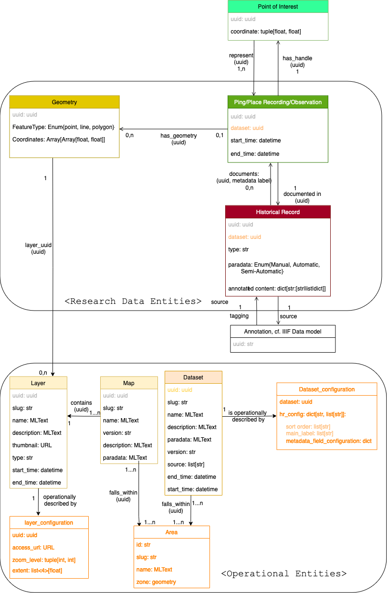

# Run the data production script

Simply runu the bash script "generate_data.sh", this will take care of installing the required dependencies, run all generation data script and validate the data. The script need to be set the execution mode to be run, so run the following command once:

```bash
chmod u+x generate_data.sh
```

Then 
```bash
generate_data.sh
```

# Data Model & Data Production
The data model is quite simple and generic, having only 8 data classes, with most of them sharing a similar set of core attributes. The principle of this modeling is to highlight the most common characteristics of any set of data that could be visualized in the Time Machine Atlas interface and generalize them into simple entites class, hereby called "Research Data Entities". At the same time, this model expects each of those entities to record as much heterogeneous and specific metadata as posisble from the original historical source while having both the backend and the frontend be made aware of dataset-level idiosyncracies. Correctly displaying, indexing and manipulating specific metadata are documented in what is called "Operational Entities" describing technical information for both a backend and frontend system on how to parse and disperese and process those informations.



[The data model can be consulted in a schema form here.](https://drive.google.com/file/d/1EIOD5CXVXQbVtyl8GyjySE-XnqohTbvL/view)

Instances of data generated through this model works loosely in a Linked-Data fashion: each entity has a unique URL, and references to other instances of data within one entity's set of parameters are done through their direct URL. URL ar constructed based on UUID attributed to each entity of the model.

## Research Data Entities (RDE)

There are seven classes of RDE to be manipulated through both the frontend and the backend of the time machine information system:
* Historical Record (HR)
* Point of Interest (PoI)
* Observation (Obs)
* Geometry  
* Dataset
* Map
* Layer

Each of these entities have specific set of properties which are described in the corresponding section down below, however they all share the following common set of properties:


```json
{
    "uuid": "<uuuid>",
    "rde_type": "[hr, poi, obs, geometry, dataset, map, layer]",
    "start_time": "<begin_date>",
    "end_time": "<end_date>",
    
}
```

* `uuid`: string, universal unique identifier of the resource. At the moment, the UUID are generated from a [uuidv5](https://en.wikipedia.org/wiki/Universally_unique_identifier#Versions_3_and_5_(namespace_name-based)) algorithm to which a custom dataset-based namespace and a string representation of the RDE is fed. The dataset, maps and layers entities and maps hold an `slug` parameter in addition, as they benefit from having a human readable identifier.
* `rde_type`: the type of the RDE according to the data model. Possible values are therefore `poi`, `hr`, `ne`, `geometry`, `dataset`, `map`, `layer`.
* `start_time` and `end_time`: datetime values formatted in string following the ISO 8601 representing the range for the time existence of the current RDE, denoting the starting and ending point of existence. **Not all RDE have time data** but as it is a common field in more than one type or RDE it is explained here.


### Historical Record (HR)

An "Historical Record (HR)" is the source from which any of the information accessible through the Local Time Machine projects comes from. It is a single "atom" of knowledge, meaning a record of information about a place, a location or a set of people found from a historical document. It is supposed to hold a direct link to a raw numeric scan of an excerpt of an historical document, and/or the transcription stemming from this document and any metadata derived from it. It can be a single entry from a census data, a row in a listing of parcels in civil registers, a sentence in an academic research book documenting a city, a photograph depicting an urban space and so forth. Wehenever possible, the granularity of the documental source should be as precise as possible, meaning the source URL should be a IIIF annotation of the information from a document's scan. The field holding the IIIF source is generated by the frontend using the UUID of the HR as indicated in the annotations of the document's manifest, it is why it is absent from this part of the model.

```json
{
    "uuid": "<uuid>",
    "dataset_id": "<ad-hoc label>", 
    "rde_type": "hr",
    "type": "[census, cadaster, registry, academic_interpretation, photograph,...]",
    "start_time": "<begin_date>",
    "end_time": "<end_date>",
    "paradata": "< m OR sa OR a>",
    "documents": [
        ["<obs_uuid_1>", "<label_related_to_obs_uuid_1>"],
        ["<obs_uuid_2>", "<label_related_to_obs_uuid_2>"],
        "..."
        ["<obs_uuid_n>", "<label_related_to_obs_uuid_n>"],
    ],
    "annotated_content": {
        "<label_1>": "<value_1>",
        "<label_2>": "<value_2>",
        "..."
        "<label_n>": "<value_n>"
    }
}
```
* `dataset`: UUID of the RDE dataset from which this HR belongs. This fields allows both the fronted and the backend to load the correct metadata configuration file, as well as filtering data objects from their sources.
* `paradata`: type of three possible value, "m" (manual), "sa" (semi-automatic), "a" (automatic/AI). Informs the user how the data was acquired from the historical record source ; For instance, if the data was acquired through manual transcription, then the value "m" should be tied to the HR. If it was through OCR with some manual correction/validation, then the metadata is set to "sa", and finally for purely automatic process without direct involvement of a human, it is set to "a". 
* `type`: a specific typology, attributed internally. For HR, it could be of values `census`, `cadaster`, `state registry`... 
* `documents`: List of tuple of `uuid`and `str`, stores the direct reference to all the Obs (or none) that are documented in the historical source (`uuid` part), while also indicating for each which part of the annotated content the observation stems from (`str`). A historical record can reference multiple locations, or none.
* `annotated_content`: Dict of arbitrary key-values pairs storing all the metadata associated with the current HR. Consult "Historical Record Metadata Configuration" for more information on how this property should be treated.


### Observation (Obs)

An "observsation" (obs) is the space time representation of the information recorded in a historical source. It is tied to a single point of physical space represented by a single latitude and longitude that has a duration in time. It can be a physical location, such as a cadaster's parcel, or an event such as an apprenticeship. In a single sentence the relationship between HR, PoI and Obs, can be summarized as "Sources are collection of historical record of observed points of interests". As a geographical entity, it is fromatted as a GeoJson object.

```json
{
    "type": "Feature", 
    "properties": { 
        "uuid": "<uuid>", 
        "dataset_id": "<ad-hoc label>", 
        "rde_type": "obs", 
        "type": "[building, street, neighborhood, event, etc,...]", 
        "start_time": "<begin_date>",
        "end_time": "<end_date>",
        "has_geometry": [
            ["layer_uuid", "<geometry_link_1>"],
            ["layer_uuid", "<geometry_link_2>"],
            "...",
            ["layer_uuid", "<geometry_link_n>"]
        ], 
        "documented_in": [
            "<hr_link_1>",
            "<hr_link_2>",
            "...",
            "<hr_link_n>"
        ],
        "has_handle": "<poi_link_1>"
    }, 
    "geometry": { 
        "type": "Point", 
        "coordinates": ["<lat>", "<lon>"]
    } 
}
```
For operational purpose, the obs are stored as GeoJson object. So it is under the `properties` attributes is where is stored most of the metadata relating to the Obs existence with relation to the dataset.
* `dataset`: UUID of the RDE dataset to which this Obs belongs. This fields allows both the frontend and the backend to load the correct metadata configuration file, as well as filtering data objects from their collection.
* `type`: a specific typology, attributed internally. For Obs it could be `building`, `monument`, `street`,... 
* `has_geometry`: List of UUID of the geometry tied to the current place observation (if any). Not all observations can have geometries and as such this field can be null.
* `documented_in`: List of UUID, those are the links of all the HR that establish the existence of the current Obs. An Obs cannot exist without a historical record attesting its existence, so the array should never be null nor empty. 
* `has_handle`: link to the PoI associated with the Obs while the `geometry` attribute simply stores the coordinate of the Obs.
* `coordinate`: tuple of float, representing the GPS coordinate of the Obs. 

If no Point of Interest exist in any dataset that could "represents" the current Obs, a new PoI is specifically created for it.


### Point of Interest (PoI)

A "Point of Interest" is what has been observed by one or many observations from a single or many dataset, and relates to a coordinate handle of the observation to place on a map. Likewise the Obs, it is a GeoJson object

```json
{
    "type": "Feature", 
    "properties": { 
        "uuid": "<uuid>", 
        "rde_type": "poi",
        "represents": [
            "<obs_link_1>",
            "<obs_link_2>",
            "..."
            "<obs_link_n>",
        ]
    }, 
    "geometry": { 
        "type": "Point", 
        "coordinates": ["<lat>", "<lon>"]
    } 
}
```

Under the `properties` attributes is where is stored most of the metadata relating the Meta Point of Interest to the whole information system.
* `coordinate`: tuple of float, representing the GPS coordinate of the PoI. It can be derived from the coordinates from all the Obs "contained" in the current PoI
* `represents`: List of UUIDs, stores the direct link of all the "observations" that are represented under the current marker.

### Geometry
A "Geometry" entity is the mathematical representation of a physical location described as a set of GPS coordinates. It can represent the parcel of a building, a street, a courtyard, a parish, or any arbitrary zone representing a geographical area which is tied to an Observation and the Historical Record documenting it.

```json
{
    "type": "Feature", 
    "properties": { 
        "uuid": "<uuid>",
        "layer_uuid": "<layer_uuid>",
        "rde_type": "geometry", 
        "start_time": "<begin_date>",
        "end_time": "<end_date>",
    }, 
    "geometry": { 
        "type": "[Polygon, Line, Point]",
        "coordinates": [  
            [ 12.3433387, 45.4382745 ], 
            [ 12.3432396, 45.4382918 ],
            "..."
        ]
    } 
}
```

Under the `geometries` attribute:
* `coordinates`: list of GPS coordinates that forms the vertices of the shape to be drawn on the map.
* `layer_uuid`: UUID of the layer the geometry belongs to.


### Dataset

The "Dataset" entity represents a homogeneous collection of information that has been ingested in the Time Machine system. It represents the link between the research data and its numerical expression and exploitation, allowing user to have access to meta/paradata on the dataset level. The entitiy is tied to operational configuration describing how the entities forming the dataset should be handled and served through an information system.

```json
{
    "uuid": "<uuid>",
    "slug": "<ad hoc label>",
    "name": "<multilingual text>",
    "description": "<multilingual text>",
    "version": "<version>",
    "paradata": "<short text>",
    "creation_date": "<timestamp>",
    "rde_type": "dataset",
    "sources": [
        "<url1>",
        "<url2>",
        "..."
    ],
    "version": "<version number>",
    "transribed_pages_amount": "<number>",
    "start_time": "<begin_date>",
    "end_time": "<end_date>",
    "configuration": "<link to corresponding operational entity>"
    
}
```
* `uuid`: UUID identifying the dataset.
* `slug`: ad-hoc label identifying the dataset.
* `creation_date`: timestamp indicating the precise moment the current version of the dataset was created. Useful for debugging purpose.
* `sources`: List of UUIDs, when available, should link to the sources used to produce the dataset. It can reference IIIF manifest (of single document, or collection of documents), permalink of facsimile from cultural institution, etc...
* `description`: multilingual text, short description of the type and range of data associated to this dataset. Should be displayed somewhere in the frontend or made easily accessible to the user. 
* `version`: short numeric-like text attributed to the dataset to denote its current version. Should be formatted in "X.Y.Z" Whenever some data is changed in any of the constituents of the dataset, it should be udated. If a a dataset is at version "1.0.0" and only small textual changes happen in its HRs for instance, it is a minor adjustement, only the smalles part of the version is incremented ("1.0.0" => "1.0.1"). If some new data points or fields have been added to the dataset while keeping its structure generally the same, it is a normal adjustement, the middle part of the version is updated ("1.0.0" => "1.1.0"). If the way the data is structured on the RDE classes is changed, it is a major adjustement and the first part of the version number is updated ("1.0.0" => "2.0.0"). 
* `paradata`: multilingual text, description on the processes and methodology used to produce the numeric data displayed by the inteface. As with the description, should be made easily accessible to the user. 
* `transribed_pages_amount`: int, amount of pages from the collection that have pages transcribed.
* `configuration`: short name of the operational entity holding the metadata configuration for the RDEs recorded in this dataset.

### Map
The "Map" entity represents a group of geographical layers stemming from a single historical map which the user can freely select in order to display it in the right-side panel of the interface (historical map view). 

```json
{
    "uuid": "<uuid>",
    "slug": "<ad-hoc label>",
    "name": "<multilingual text>",
    "description": "<multilingual text>",
    "rde_type": "map",
    "start_time": "<begin_date>",
    "version": "<version>",
    "end_time": "<end_date>",
    "contains": [
      "<layer_uuid1>",
      "<layer_uuid2>",
      "...",
      "<layer_uuidN>"
    ]
}
```
* `map_id`: short string identifying the map.
* `name`: very brief description of the map to be displayed by the frontend in the map choice.
* `description`: rich-text, concise description of the content and process by which the map was produiced, as well as any related information. This should be easily accessible to the user on the frontend.
* `contains`: list of uuids from layers that are derived from the current Map.
* `version`: version label of the current map. Follows the same principle as described in the dataset object.

### Layer
A layer is a snythetic derivation from a map stemming either from a vectorization of a specific type of content from the map, or from the actual digital facsimile of the map. It is basically an abstraction of the objects that the user can manipulate to display as a 2D planar field in the interface. It is described by the following base set of fields:

```json
{
    "uuid": "<uuid>",
    "name": "<multilingual text>",
    "map_id": "<ad-hoc label>",
    "rde_type": "layer",
    "start_time": "<begin_date>",
    "end_time": "<end_date>",
    "is_operationally_described_by": {
        "access_url": "<url pointing to the map's access on the geoserver>",
        "crs": "<crs value>",
        "zoom_level": ["<min_zoom_level>", "<max_zoom_level>"],
        "extent": ["<N>", "<W>", "<E>", "<S>"]
    }  
}
```
* `map_id`: indicating from which map the current layer is part of.
* `name`: very brief description of the layer to be displayed by the frontend in the overlay choices.

In addition to this core set of fields, type specific fields are possible according to the type of layers found within the interface:

* "Geometrical Layers" (i.e. vectorization from the historical map) with the field `formed_by`
* "Background Layer" (i.e. digital facsimile of the historical map) with the field `is_operationally_described_by`
* `is_operationally_described_by`: 
* `access_url`: URL on the geoserver that serves the tiles for building the layer on the frontend.
* `crs`: the coordinate system used to display the map.
* `zoom_level`: tuple of int, describe the minimum first then maximum zoom level available for the display of the layer.
* `extent`: Array of four float values, representing the bounding box boundary of the layer in values expressed through the CRS described above. Order of the extent boundaries are North, West, East and South.

## Operational Entities (OE)

### Multlingual text

Whenever a RDE has a field that can be expressed in multiple language (like its name, description or display label), it is expressed using an object following the same principle as in the IIIF format for multilingual description:

```json
{
    "<lan1>": ["<lan1_value1>",  "<lan1_value2>", "...", "<lan1_valueN>"],
    "<lan2>": ["<lan2_value1>",  "<lan2_value2>", "...", "<lan2_valueN>"],
    "..."
    "<lanN>": ["<lanN_value1>",  "<lanN_value2>", "...", "<lanN_valueN>"],
}
```
`lanX` denotes a short 2-3 letters identifier of the language, each time multiple values can be attributed. To give an example here is the multilingual text associated to the "name" of the Sommarioni dataset:

```json
"name": {
  "en": [
   "Napoleonic Cadaster of 1808"
  ],
  "fr": [
   "Cadastre napoléonien de 1808"
  ],
  "it": [
   "Catasto Napoleonico del 1808"
  ]
 }
```

### Metadata types
* STRING: string of unicode characters, stores text's content of arbitrary length.
* INTEGER: whole number, positive or negative.
* FLOAT: decimal numbers.
* DATE: An encoding of a time frame. Formatted in the classical timestamps format.
* CATEGORY: denotes field that have been standardized, and thus have a dictionary registering all possible values and their visual representation.
* LIST[]: a list of values of set type. The syntax of such composite type would be "LIST\[`<type>`\]". For instance, a list of standardized information is written as "LIST\[CATEGORICAL\]" while a list of rent prices would be written as "LIST\[FLOAT\]".


### HR Configuration Entity

```json
{
    "id": "<ad-hoc label>",
    "dataset": "<dataset_uuid>",
    "hr_config": {
        "main_label": "<formatted>",
        "sub_label": "<formatted>",
        "metadata_field_config": [
            {"≤RDE Metadata Configuration Object 1>"},
            "..."
            {"≤RDE Metadata Configuration Object n>"}
        ]    
    }
}
```

* `creation_date`: timestamp indicating the precise moment the current version of the configuration file was created. Useful for debugging purpose.
* `main_label`: A formatting string, indicate which metadata to use for displaying the main label of the object in search results, and how to format them in a string.
* `main_label`: A formatting string, similar purpose as the `main_label`, only for a potential sub label.
* `metadata_field_config`: List of JSON object of set form, describes how the frontend and/or the backend should manipulate the values recorded in the HR's `metadata` property. Consult the next section for documentation regarding this property.

**NOTE**:  It might be possible that other RDE types than the HR might require some specific per-dataset configuration. If that is the case, a similar parametre as `hr_config` will contain a new configuration dict which will be described in this document.


#### RDE Metadata configuration

The field name as it is written in the keys of the "metadata_dict" of an RDE should have configuration information stored as a dict that may have the following properties:

```json
{
    "id": "<field_name>",
    "uuid": "<uuid of the field>",
    "type": "<metadata_type>",
    "display_label": "<multilingual text>", 
    "display_order": "<integer, 1 to the amount of metadata field>", 
    "dictionary": "<dictionary_identifier",
    "nullable": "<JSON boolean value (`true` of `false`)>",
    "indexable": "<JSON boolean value (`true` of `false`)>",
    "short_display": "<JSON boolean value (`true` of `false`)>",
    "hidden": "<JSON boolean value (`true` of `false`)>",
    "tag": "<set of value in [PEOPLE, PLACE, PROFESSION]"
},
```
* `id`: the metadata field name as it appears directly in the HR.
* `uuid`: operational uuid for the current field configuration. 
* `type`: the current type of the metadata, check the section above to see the possible values. 
* `display_label`: string or URL, if of type string, it is the default label the user should see for the metadata value. If no value are specified in the metadata configuration, the technical label (i.e. the `field_name`) should be used. 
* `display_order`: integer, indicates the order in which it is displayed in the full view of the HR.
* _Optional_ `dictionary`: URL or string, in case the type of the current metadata is `CATEGORY`, this field should be present and point toward the dictionary Operational Entity refered by the value of this field (`<dictionary_identifier>`). Consult the "dictionary Entity" for more information regarding this case.
* `nullable`:  boolean, whether the field may hold empty value. In case the metadata type is "LIST", then a true value for `nullable`, means the metadata can be an empty list. This parameter should be considered in case such a field is associated to a specific display or research verb. 
* `indexable`:  boolean, whether the field is indexed in the Time Machine search engine for full-text search.
* `short_display`: whether this field should by default be display in the card view in the interface 
* `hidden`: whether the field should not be displayed to a normal user in any way, but is still presents in the RDE object. Mainly concerns operational data such as internal identifiers, or fields we might want to interact with interanlly.

### dictionary Entity
_(Unused currently)_ 

A dictionary entity holds standardized unique information. This means all values for a certain metadata field within a single or many datasets have been matched to unified normalized labels which is what the dictionary entity records. For efficient search features purpose (such as facets and dropdown value selection), those normalized values are stored in a dictionary within the backed. This allows the frontend to consult the values of the dictonnary to propose them as selection for the user in order to refine its search. The backend can use the dictionary to build index on fields that have been normalized and thus makes the search more efficient. A dictionary also holds the display value of each normalized field, such value should be leveraged by the frontend

```json
{
    "id": "<ad-hoc label>",
    "value_type":"<dictionary values types>",
    "dict":{
        "<VALUE_1_STANDARDIZED>": "<display_value_1>",
        "<VALUE_2_STANDARDIZED>": "<display_value_2>",
        "..."
        "<VALUE_N_STANDARDIZED>": "<display_value_n>",
    }
}
```

* `id`: the unique identifier of the dictionary within the system. It is refered in the RDE Metadata configuration for entites 
* `value_type`: type, indicates the type of the display value.
* `dict`: dictionary of all the standardized value and their corresponding display data.


### Typology
_(Unused currently)_ 
Describes typology used by RDE. Defined internally in order to have controlled values for the types of the RDE. Similar in principles to the dictionary, instead the value they hold are not derived from data standardisation but arbitrary categorisation made on the nature of data. The amount of Type OE should be equal to the number of RDE classes that have types, so 7 so far (HR, PoI, Obs, Geometry, NE, Map & Dataset)

```json
{
    "id": "<ad-hoc lavel>",
    "documents_rde": "<rde_type>",
    "types": [
        "<type_label_1>",
        "<type_label_2>",
        "...",
        "<type_label_n>",
    ]
}
```

* `id`: the unique identifier of this 
* `documents_rde`: holds the short name of the RDE whose typology is described by this entity
* `types`: array of string describing all possible type the RDE described by this typology can be of. 

