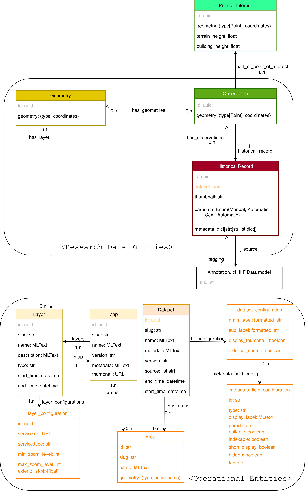

# Run the data production script

Simply run the bash script "generate_data.sh", this will take care of installing the required dependencies, run all generation data script and validate the data. The script needs to be set the execution mode to be run, requiring the following command to be issued once:

```bash
chmod u+x generate_data.sh
```

Then 
```bash
./generate_data.sh
```

# Data Model & Data Production
The data model is quite simple and generic, having only 8 data classes, most of which share a similar set of core attributes. The principle of this modeling is to highlight the most common characteristics of any set of data that could be visualized in the Time Atlas interface and generalize them into simple entities class, hereby called "Research Data Entities". At the same time, this model expects each of those entities to record as much heterogeneous and specific metadata as posisble from the original historical source in a way that both the backend and the frontend are aware of dataset-level idiosyncracies. Correctly displaying, indexing and manipulating specific metadata are documented in "configuration" objects describing technical information for both a backend and frontend system on how to parse, disperse and process those informations. Only layers and dataset are concerned by those so-called "configuration" objects.



[The data model can be consulted in a schema form here.](https://drive.google.com/file/d/1EIOD5CXVXQbVtyl8GyjySE-XnqohTbvL/view)

Instances of data generated through this model are related using numerical identifier : each entity has a unique UUID, and references to other instances of data within one entity's set of parameters are done through their UUID. When ingested in the backend, those UUID are transformed into URL, making the interconnection between the entities work in a loose linked-data fashion. The UUID generated is still part of the generated URL. URL are not used in the data generation part, as the data is agnostic to the API domain through which it is eventually accessed.

At first glance, the name of the fields holding the relationship between the entities might seems a bit inconsistent, they however follow a systemic logic that tries to semantically represent the cardinality of the relationship:
* Exactly one (1): semantic of the singular RDE type's name. (HR => Dataset (`dataset`), Obs => HR (`historical_record`), Obs => Dataset (`dataset`), Layer => Map (`map`))
* One or Zero (< 2): semantic of the `part_of_<rde_type>` (Obs => PoI (`part_of_point_of_interest`) , Geometry => Layer (`part_of_layer`))
* Zero or Many: semantic of `has_<type-plural>` (HR => Obs (`has_observations`), Obs => Geometries (`has_geometries`), Dataset => Area (`has_areas`))
* Obligatory Many (> 0): semantic of the RDE type's name to the plural (Maps => Layers (`layers`), Map => Area (`areas`))


## Research Data Entities (RDE)

There are eight classes of RDE to be manipulated through both the frontend and the backend of the time machine information system:
* Historical Record (HR)
* Point of Interest (PoI)
* Observation (Obs)
* Geometry  
* Dataset
* Map
* Layer
* Area

Each of these entities have specific set of properties which are described in the corresponding section down below, however they may share some fields described below:


```json
{
    "id": "<uuid>",
    "rde_type": "[historical_record, poi, observation, geometry, dataset, map, layer, layer_configuration, area]",
    "start_time": "<begin_date>",
    "end_time": "<end_date>",
    
}
```

* `id`: string, universal unique identifier of the resource. At the moment, the UUID are generated from a [uuidv5](https://en.wikipedia.org/wiki/Universally_unique_identifier#Versions_3_and_5_(namespace_name-based)) algorithm to which a custom dataset-based namespace and a unique deterministic identifier stemming from the data. If possible, the UUID generated should be deterministic with respect to the namespace and identifier given, so that new version of the dataset share as similar identifiers as possible. The dataset, areas, maps and layers entities also hold an `slug` parameter in addition, as they benefit from having a human readable identifier.
* `rde_type`: the type of the RDE according to the data model. Possible values are therefore `poi`, `historical_record`, `observation`, `geometry`, `dataset`, `map`, `layer`, `layer_configuration` and `area`.
* `start_time` and `end_time`: datetime values formatted in string following the ISO 8601 representing the range for the time existence of the current RDE, denoting the starting and ending point of existence. **Not all RDE have time data**, currently it concerns HR, dataset, maps and layers, but as it is a common field in more than one type or RDE it is explained here.


### Historical Record (HR)

An "Historical Record (HR)" is the source from which any of the information accessible through the Local Time Machine projects comes from. It is a single "atom" of knowledge, meaning a record of information about a place, a location or a set of people found from a historical document. It is supposed to hold a direct link to a raw numeric scan of an excerpt of an historical document, and/or the transcription stemming from this document and any metadata derived from it. It can be a single entry from a census data, a row in a listing of parcels in civil registers, a sentence in an academic research book documenting a city, a photograph depicting an urban space and so forth. Wehenever possible, the granularity of the documental source should be as precise as possible, meaning the source URL should be a IIIF annotation of the information from a document's scan. The field holding the IIIF source is generated by the frontend using the UUID of the HR as indicated in the annotations of the document's manifest, hence it is absent from this part of the model.

```json
{
    "id": "<uuid>",
    "rde_type": "historical_record",
    "start_time": "<begin_date>",
    "end_time": "<end_date>",
    "dataset": "<uuid>",
    "paradata": "<`m` OR `sa` OR `a`>",
    "has_observations": [
        "<obs_uuid_1>",
        "<obs_uuid_2>",
        "..."
        "<obs_uuid_n>",
    ],
    "metadata": {
        "<label_1>": "<value_1>",
        "<label_2>": "<value_2>",
        "..."
        "<label_n>": "<value_N>"
    }
}
```
* `dataset`: UUID of the dataset from which this HR belongs. This fields allows both the fronted and the backend to load the correct metadata configuration file, as well as filtering data objects from their sources.
* `paradata`: type of three possible value, "m" (manual), "sa" (semi-automatic), "a" (automatic/AI). Informs the user how the data was acquired from the historical record source ; For instance, if the data was acquired through manual transcription, then the value "m" should be tied to the HR. If it was through OCR with some manual correction/validation, then the metadata is set to "sa", and finally for purely automatic process without direct involvement of a human, it is set to "a". 
* `has_observations`: List of `uuid`, stores the direct reference to all the Obs (or none) that are documented in the historical source. A historical record can reference multiple locations, or none.
* `metadata`: Dict of arbitrary key-values pairs storing all the metadata associated with the current HR. Consult "Historical Record Metadata Configuration" for more information on how this property should be treated.

### Observation (Obs)
An "observsation" (obs) is the space time representation of the information recorded in a historical source. It is tied to a single point of physical space represented by a single latitude and longitude. It can be a physical location, such as a cadaster's parcel, or an event such as an apprenticeship. In a single sentence the relationship between HR, PoI and Obs, can be summarized as "Sources are collection of historical record of observed points of interests". It is kind of a pivot data entity, as it serves to link to the HR, the PoI and the geometries. A single HR can hold multiple Observations, this is a flexibility assumed by the model which is useful in cases where multiple locations or events are mentioned in a single record (for instance, a postcard of a city wide in which multiple landmarks have been identified, each of those landmarks get a single dedicated Observation).

```json
{
    "id": "<uuid>", 
    "rde_type": "obs", 
    "has_geometries": [
        "<geometry_link_1>",
        "<geometry_link_2>",
        "...",
        "<geometry_link_n>"
    ], 
    "historical_record": "<hr_link>",
    "part_of_point_of_interest": "<poi_link>",
    "geometry": { 
        "type": "Point", 
        "coordinates": ["<lat>", "<lon>"]
    } 
}
```
* `has_geometries`: List of UUID of the geometry tied to the current observation (if any). Not all observations can have geometries and as such this field can be null.
* `historical_record`: UUID, link of the HR that establish the existence of the current Obs. An Obs cannot exist without a historical record attesting its existence, this field should never be null. 
* `part_of_point_of_interest`: link to the PoI associated with the Obs. It can be empty, in the case of unprecisely geolocated document that still needs some vague spatial indexing through it. (for instance a postcard that was located at the city level, will have for its observation's geometry the centroid of such city, without points of interest).
* `geometry`: GPS coordinates of the Observation. Although the Observations are not displayed by the frontend on the base map (this duty is reserved to the PoI), it is still useful for spatial indexing and unprecise geoindexing of records. 

If no Point of Interest exist in any dataset that could "hold" the current Obs, a new PoI is specifically created for it.

### Point of Interest (PoI)
A "Point of Interest" is what has been observed by one or many observations from a single or many dataset, and relates to a coordinate handle of the observation to place on a map. They can be pointed by multiple Observations from different dataset, acting as an aggregate by virtue of having observation located on the same exact coordinate space.

```json
{
    "id": "<uuid>", 
    "rde_type": "poi",
    "terrain_height": "<float_value>",
    "building_height": "<float_value>",
    "geometry": { 
        "type": "Point", 
        "coordinates": ["<lat>", "<lon>"]
    } 
}
```

* `geometry`: tuple of float under the `coordinates` field, representing the GPS coordinate of the PoI. It can be derived from the coordinates from all the Obs that "point" to the current PoI
* `terrain_height` & `building_height`: elevation information about the current point, separated between the terrain and building height, both expressed in meters. This information is generally reference by the system and stems from Maptiler's Database. This is used by the interface to correctly place the PoI in the 3D vision mode. 

### Geometry
A "Geometry" entity is the mathematical representation of a physical location described as a set of GPS coordinates. It can represent the parcel of a building, a street, a courtyard, a parish, or any arbitrary zone representing a geographical area which is tied to an Observation and the Historical Record documenting it. It can also exist without being referenced by a record, it will as such only exist in the system as part of a Layer object of type "vector".

```json
{
    "id": "<uuid>",
    "rde_type": "geometry", 
    "has_layer": "<layer_uuid>",
    "geometry": { 
        "type": "[Polygon, LineString, Point, MultiPolygon, MultiLineString]",
        "coordinates": [  
            [ 12.3433387, 45.4382745 ], 
            [ 12.3432396, 45.4382918 ],
            "..."
        ]
    } 
}
```

* `coordinates`: list of GPS coordinates that forms the vertices of the shape to be drawn on the map.
* `has_layer`: optional UUID of the layer the geometry belongs to.

### Area
```json
{
    "id": "<uuid>",
    "rde_type": "area",
    "slug": "<ad hoc label>",
    "name": "<multilingual text>",
    "geometry": { 
        "type": "[Polygon, LineString, Point, MultiPolygon, MultiLineString]",
        "coordinates": [  
            [ 12.3433387, 45.4382745 ], 
            [ 12.3432396, 45.4382918 ],
            "..."
        ]
    } 
}
```
The area is a special geometric entity that represents the boundary of a specific geographical entity, wether it is a continent, country, city, or ad-hoc administrative zone. It is useful to index maps and datasets to ad-hoc curated areas in the the Time Atlas.

### Dataset

The "Dataset" entity represents a homogeneous collection of information that has been ingested in the Time Machine system. It represents the link between the research data and its numerical expression and exploitation, allowing user to have access to meta/paradata on the dataset level. The entitiy is tied to operational configuration describing how the entities forming the dataset should be handled and served through an information system.

```json
{
    "id": "<uuid>",
    "rde_type": "dataset",
    "start_time": "<begin_date>",
    "end_time": "<end_date>",
    "slug": "<ad hoc label>",
    "name": "<multilingual text>",
    "metdata": [
        "<metadata_field_1>",
        "<metadata_field_2>",
        "..."
        "<metadata_field_N>",
    ],
    "version": "<version>",
    "creation_time": "<timestamp>",
    "sources": [
        "<url1>",
        "<url2>",
        "..."
    ],
    "has_areas": [
        "<area_link_1>",
        "<area_link_2>",
        "...",
        "<area_link_N>",
    ],
    "version": "<version number>",
    "configuration": "<link/embedding to corresponding operational entity>"
}
```
* `slug`: ad-hoc label identifying the dataset.
* `name`: multilingual text (cf. operation entities section), short title of the dataset to be displayed as header in the frontend.
* `metadata`: list of free form metadata field (cf. operational entities below), recording any number of contextual information about the dataset.
* `creation_time`: timestamp indicating the precise moment the current version of the dataset was created. Useful for debugging purpose.
* `version`: short numeric-like text attributed to the dataset to denote its current version. Should be formatted in "X.Y.Z" Whenever some data is changed in any of the constituents of the dataset, it should be udated. If a a dataset is at version "1.0.0" and only small textual changes happen in its HRs for instance, it is a minor adjustement, only the smalles part of the version is incremented ("1.0.0" => "1.0.1"). If some new data points or fields have been added to the dataset while keeping its structure generally the same, it is a normal adjustement, the middle part of the version is updated ("1.0.0" => "1.1.0"). If the way the data is structured on the RDE classes is changed, it is a major adjustement and the first part of the version number is updated ("1.0.0" => "2.0.0"). 
* `sources`: List of UUIDs, when available, should link to the sources used to produce the dataset. It references IIIF manifests (of single document, or collection of documents).
* `has_areas`: all areas the dataset is related to. Can be empty.
* `configuration`: operational entity holding the metadata configuration for the HRs from this dataset. Cf. "Dataset configuration" subsection from the "Operotinal Entities" section below.

### Map
The "Map" entity represents a group of geographical layers stemming from a single historical map which the user can freely select in order to display it in the interface. 

```json
{
    "id": "<uuid>",
    "rde_type": "map",
    "slug": "<ad-hoc label>",
    "name": "<multilingual_text>",
    "metdata": [
        "<metadata_field_1>",
        "<metadata_field_2>",
        "..."
        "<metadata_field_N>",
    ],
    "start_time": "<begin_date>",
    "version": "<version>",
    "thumbnail": "<iiif_img_url>",
    "end_time": "<end_date>",
    "layers": [
      "<layer_uuid1>",
      "<layer_uuid2>",
      "...",
      "<layer_uuidN>"
    ],
    "areas": [
        "<area_link_1>",
        "<area_link_2>",
        "...",
        "<area_link_N>",
    ],
}
```
* `slug`: short string identifying the map.
* `name`: multilingual text (cf. operation entities below), short title of the map to be displayed as header in the frontend.
* `metadata`: list of free form metadata field (cf. operational entities below), recording any number of contextual information about the map.
* `layers`: list of UUIDs from layers that are derived from the current Map.
* `thumbnail`: URL that links to an image following the IIIF protocol to be displayed on the frontend as the thumbnail for the map.
* `version`: version label of the current map. Follows the same principle as described in the dataset object.
* `areas`: all areas the dataset is related to. A map must necesseraily be tied to at least one area (the list cannot be empty).

### Layer
A layer is a synthetic derivation from a map stemming either from a vectorization of a specific type of content from the map, or from the actual digital facsimile of the map. It is basically an abstraction of the objects that the user can manipulate to display as a 2D planar field in the interface. It is described by the following base set of fields:

```json
{
    "id": "<uuid>",
    "rde_type": "layer",
    "slug": "<ad-hoc label>",
    "map": "<map link>",
    "name": "<multilingual text>",
    "description": "<multilingual_text>",
    "type": "<vector OR raster>",
    "start_time": "<begin_date>",
    "end_time": "<end_date>",
    "layer_configurations": [
        "<layer_configuration_link_1>",
        "<layer_configuration_link_2>",
        "...",
        "<layer_configuration_link_N>",
    ] 
}
```
* `map`: indicating from which map the current layer is part of.
* `name`: multilingual text (cf. operation entities below), short title of the dataset to be displayed as header in the frontend.
* `description`: very brief description of the layer to be displayed by the frontend in the overlay choices.
* `type`: can hold two string values either "vector" (i.e. the layer is formed of Geometries entity that point to it using the field `part_of_layer`), or "raster", which means the layer is an image that is stored through tile in the geoserver.
* `layer_configurations`: list of "Layer Configuration" entities, which describre through which service and format the layer can be accessed by the frontend (cf. "Layer Configuration" subsection in the "Configuration Entities")

## Configuration entities 

### Free form metadata field

For both maps and dataset, there is a field "metadata" which hold free form metadata of any contextual information that relates to the entity. As they are arbitrary, both the label and the value have to be specified in multilingual entities. They are expressed following this format:

```json
{
     "type": "<metadata_type>",
     "label": "<multilingual_text_object>",
     "value": "<multilingual_text_object>"
}
```

### Multlingual text

Whenever a RDE has a field that can be expressed in multiple language (like its name, a description or display label), it is expressed using an object following the same principle as in the IIIF format for multilingual description:

```json
{
    "<lan1>": ["<lan1_value1>",  "<lan1_value2>", "...", "<lan1_valueN>"],
    "<lan2>": ["<lan2_value1>",  "<lan2_value2>", "...", "<lan2_valueN>"],
    "..."
    "<lanN>": ["<lanN_value1>",  "<lanN_value2>", "...", "<lanN_valueN>"],
}
```
`lanX` denotes a short 2-3 letters identifier of the language, each time multiple values can be attributed. To give an example here is the multilingual text associated to the "name" of the Sommarioni dataset:

```json
{
  "en": [
   "Napoleonic Cadaster of 1808"
  ],
  "fr": [
   "Cadastre napoléonien de 1808"
  ],
  "it": [
   "Catasto Napoleonico del 1808"
  ]
}
```

### Metadata types

In the free form metadata fields of the dataset and maps as well as the configuration of HR in the dataset configuration, "type" fields are present which can display the following string valued:

* STRING: string of unicode characters, stores text's content of arbitrary length.
* INTEGER: whole number, positive or negative.
* FLOAT: decimal numbers.
* URL: an url.
* LIST[]: a list of values of set type. The syntax of such composite type would be "LIST\[`<type>`\]". For instance, a list of standardized information is written as "LIST\[CATEGORICAL\]" while a list of rent prices would be written as "LIST\[FLOAT\]".


### layer configuration

```json
{
    "id": "<uuid>",
    "rde_type": "layer_configuration",
    "service": {
        "url": "<url pointing to the map's access on the geoserver>",
        "type": "<layer format>"
    },
    "min_zoom_level": "<min_zoom_level>",
    "max_zoom_level": "<max_zoom_level>",
    "extent": ["<N>", "<E>", "<S>", "<W>"]
} 
```

* `service.url`: URL on the geoserver that serves the tiles for building the layer on the frontend.
* `service.type`: short string of the tile type (MVT, WMTS, XYZ,...)
* `min_zoom_level/max_zoom_level`: tuple of int, describe the minimum first then maximum zoom level available for the display of the layer.
* `extent`: Array of four float values, representing the bounding box boundary of the layer in values expressed through the CRS described above. Order of the extent boundaries are North, East, South and West.

### dataset configuration

```json
{
    "main_label": "<formatted>",
    "sub_label": "<formatted>",
    "display_thumbnail": "<boolean>",
    "external_source": "<boolean>",
    "metadata_field_config": [
        {"≤RDE Metadata Configuration Object 1>"},
        "..."
        {"≤RDE Metadata Configuration Object n>"}
    ]    
}
```

* `main_label`: A formatting string, indicate which metadata to use for displaying the main label of the object in search results, and how to format them in a string.
* `sub_label`: A formatting string, similar purpose as the `main_label`, only for a potential sub label.
* `display_thumbnail`: boolean which indicates wether the HR from this dataset have a thumbnail that should be displayed on the frontend card view. If such is the case, the thumbnail is sourced by the backend from the first image of the IIIF manifest tied to the HR.
* `external_source`: boolean which indicates wether the source button on the HR in the frontend should forward to an external URL rather than the built-in source viewer. In such cases, the URL of the source is stored in the IIIF web annotation linked to the HR.
* `metadata_field_config`: List of JSON object which describes how the frontend and/or the backend should manipulate the values recorded in the HR's `metadata` property. Consult the next section for documentation regarding this property.

**NOTE**:  It might be possible that other RDE types than the HR might require some specific per-dataset configuration. If that is the case, a similar parametre as `metadata_field_config` will contain a new configuration dict which will be described in this document.

#### RDE Metadata configuration

The field name as it is written in the keys of the "metadata" dictionnary of an HR is referenced in the dataset configuration with the following set of properties:

```json
{
    "id": "<field_name>",
    "type": "<metadata_type>",
    "display_label": "<multilingual text>", 
    "paradata": "< m OR sa OR a OR ai>",
    "nullable": "<JSON boolean value (`true` of `false`)>",
    "indexable": "<JSON boolean value (`true` of `false`)>",
    "short_display": "<JSON boolean value (`true` of `false`)>",
    "hidden": "<JSON boolean value (`true` of `false`)>",
    "tag": "<set of value in [PEOPLE, PLACE, PROFESSION]"
},
```
* `id`: the metadata field name as it appears directly in the HR.
* `type`: the current type of the metadata, check the section above to see the possible values. 
* `display_label`: multilingual text, indicates the name of the field to be displayed next to the value in the frontend page.
* `paradata`: type of three possible value, "m" (manual), "sa" (semi-automatic), "a" (automatic) or "ai" (artificial intelligence). Informs the user how the data was acquired/produced for this specific metadata field. Translates in the interface to a small icon on the metadata field value. 
* `nullable`:  boolean, whether the field may hold empty value. In case the metadata type is "LIST", then a true value for `nullable`, means the metadata can be an empty list. This parameter should be considered in case such a field is associated to a specific display or research verb. 
* `indexable`:  boolean, whether the field is indexed in the Time Machine search engine for full-text search.
* `short_display`: whether this field should by default be display in the card view in the interface 
* `hidden`: whether the field should not be displayed to a normal user in any way, but is still presents in the RDE object. Mainly concerns operational data such as internal identifiers, or fields we might want to interact with interanlly.
* `tag`: one of 3 values, "PEOPLE", "LAND_USE" and "PLACE", indicates the information system of a broad category for this field. Useful to trigger specific facet search.