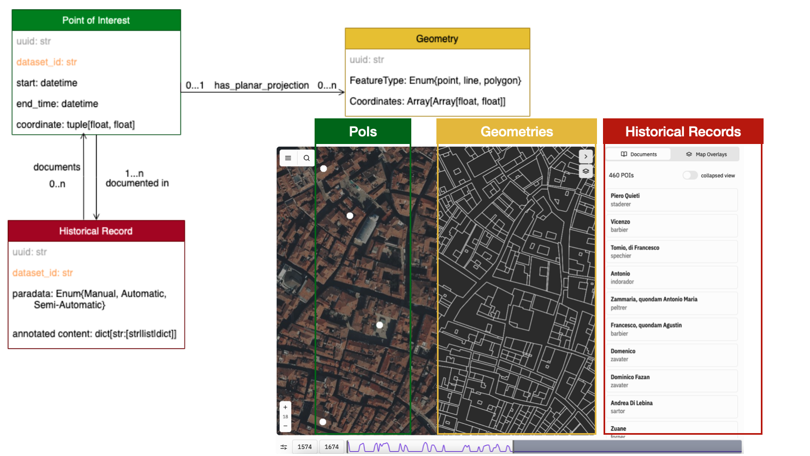
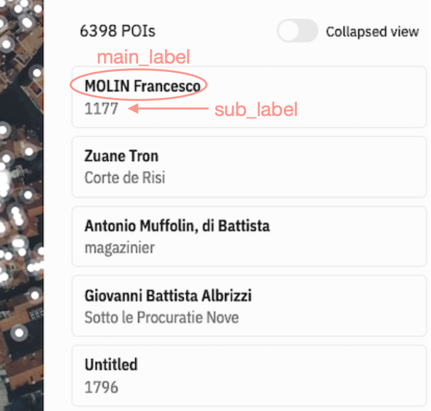

# Data Modeling for ingestion on the Parcels Of Venice interface
This is a quick guide on how to pre-model data in order to be ingested in the Parcels of Venice information system, so eventually the data can be ingested and played around on the interface. Even though the actual data ingested is modeled as JSON objects, this guide explains how to format the data in an ad-hoc `CSV` instead. This file will in turn be mapped to the actual data model by in-development scripts of the project's data manager.

## Overview

The schema above is a simplification of the actual data model, however it conveys which are the most important fields to be extracted from the data transmitted, and how each of these fields actually map to a specific interactive part of the interface. 

#### Historical Record (HR)
The "Historial Record (HR)" corresponds roughly to the "semantic atom" of a dataset to be ingested, most likely a textual information stemming from a transcription (or generation effort). To take the examples of the current data available on the interface, for the Sommarioni and the Catastici, their HR corresponds to a single entry/row from each of their registry, while for Garzoni, it corresponds to an apprenticeship contract. The HR holds generally the transcribed text, which can be split into arbitrary categories/subentries; for instance, in the Catastici, each HR has a subentry "an_rendi" relating to taxation information which is absent from Sommarioni and Garzoni, while both of them also feature sub-entries of different natures. All those subentries are represented in the schema by the field `annotated_content` whish is an arbitrary dictionnary of various values. The only HR field that is common to each dataset is the "paradata" field, that denotes whether the current HR stems from a manual transcription/production (value `m`), from an computer/automatic based production (value `a`) or a combination of both approaches (value `sa`).

#### Point of Interest (PoI)
The "Point of Interet (PoI)" is the space-time representation of what is identified in the HR. On the interface it corresponds to the white dots, basically acting as a coordinate handle to the data, and is sensible to the time scale selector from the bottom of the interface. It only features a single gps coordinate (where to draw the white dot) and a range of time (when the white dot should appear). In the case of datasets having cadastral footprints (such as the sommarioni), this coordinate stems from the centroid of the cadaster's geometry (so basically an derivative data from the geometries entity). The time range field is expressed as two datetime objects, denoting the beginning and end of the time range for which the object georeferenced might have existed.

#### Geometries
Finally the "geometries" are simply footprints or any other 2D shape related to the data that has been extracted. They are displayed in the right panel (not activated by default, needs to be enabled in the settings). It is optional, for instance we don't have geometries for the Catastici dataset.

## CSV format

The CSV file transmitted should simply be given a short name that identifies the dataset as uniquely as possible. In the case of the Sommarioni for instance it is "venice-sommarioni-1808" while for the Catastici it is "venice-catastici-1740". If you are a student of the 2024's edition of the FDH course, I'd ask you to prefix your dataset name by "fdh-2024-sdata". If you have geometrie to be displayed, they need to be stored in a separate geojson file which should have the same name as the csv. 

The CSV should feature the following mandatory columns:

* `paradata`: even if all entries have been generated by the same process, and thus share the same value, this column should be present in each row and feature any of the following values: `a`, `sa`, `m`.
* `unique_id`: a single positive integer that uniquely identifies the current row. This will serve a seed for the [UUID](https://en.wikipedia.org/wiki/Universally_unique_identifier) generated for the entry in the interface eventually. This can be useful to keep the same uuid in different version of the dataset.
* `coordinate`: a single GPS coordinate **expressed in the coordinate reference system (CRS) `WGS84/EPGS:4326`**, this informs the frontend where to draw the white dot on the map of Venice. The value held in this column should be formatted according to the [Well-Known Text (WKT) format](https://en.wikipedia.org/wiki/Well-known_text_representation_of_geometry).
* `start_date` & `end_date`: the time range of the object referenced on the map. It should be expressed in the standard datetime format as a string (i.e. `YYYY-MM-DDTHH:MM:SS`). If the only time dependant information extracted for the object is a single year, let's say "1808", then the two values produced should represent the earliest second of the year 1808 for `start_date` (*1808-01-01T00:00:00*) and the last possible second of the year for the end date (*1808-12-31T23:59:59*). The same principle applies if the definition of the date is precise to  only a century, a decade, a month, a day, or even an hour.
* `geometry_id`: a positive integer that relates to a single (or group of) geometry from the geojson file. The corresponding geometry in the geojson file should have a field also named `geometry_id` as an attribute in the `properties` sub-object. This is holding the value that can link to CSV entry to the geometry. If multiple geometries relate to a single CSV entry, all those geometries in the geojson file should hold the same value in `geometry_id`. This column should be present **even** if there are no geometries to be linked in the current data. If such a case, the column can be left empty and no geojson file is to be expected. Likewise the `coordinate` field, all geometries in the geojson should have their points being **expressed in the CRS `WGS84/EPGS:4326`**. 

Then any other values extracted (everything considered `annotated_content`) from the data can be put in an arbitrary number of columns named however it makes sense (juste make sure the name doesn't feature weird characters or accents, let's keep everything as letters, number and "_").

## configure the data for searching & displaying
With the data model being this generic, and with all actual domain-related information being stored in arbirary fields from the HR under `annotated_content`, the system needs a dataset specific "configuration file" in order to know what can be queried in the data, and how to display select fields on the UI. This file is a JSON named the same way as you CSV, holding a single JSON object holding some information:

### searching
Whenever you make a search query on the interface, the backend performs a full text search on selected fields from each datasets. Not all fields in each datasets are indexed, for instance, in the Catastici it doesn't make sense to do a search for the numeric value related to taxes (field `an_rendi`), but it does make sense to search for the name of the owner (field `owner_name`) or the tenants (field `ten_name`) of a parcel. That is why you need to specify in the configuration file which fields you'd like the search engine to index. In the configuration json object, write under the field `indexable` a list of fields name that should be indexed by the search engine during the ingestion of your data. All those fields should related to the annotated content, you cannot index the mandatory fields as described in the previous section.

### displaying
There is multiple views on the interface under which the data can be seen. Once you click on a white dot, you can see a card displaying part of the metadata related to the current HR, the fields to be displayed under this "short-display" of the data should be indicated in the configuration file in a list under the field `short_display`. 

When you open up the "Documents" panel on the right, a paginated view of all HR currently in the viewpoint are displayed. For each HR, a "main label" in bold and "sub label" in gray are displayed. The HR fields to interpolate in both these value can be declared in the configuration file under fields named `main_label` and `sub_label` respectively. Multiple fields can be displayed together if needed by using string interpolation syntax with dollar sign. See the example to get an idea.

Finally, some general information regarding the dataset itself are required to be provided, such as a title (field `name`), a contextual description (field `description`) and an explanation on the process by which the data went through (field `paradata`). The description an paradata should a concise text, no more than a couple of sentence in pure text (no rich-text formatting nor URLs are expected there).

## Example
In the folder `example` you can see a sample (100 entries linked to 139 geometries) of the data from the Sommarioni formatted according to the instructions above to help you get started. 